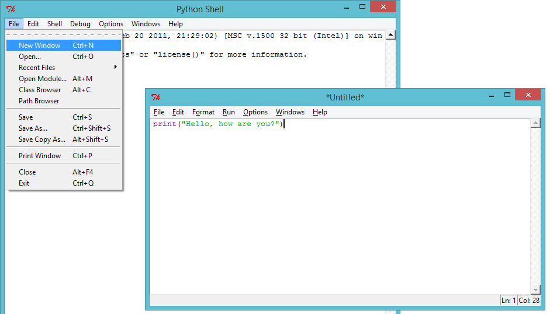
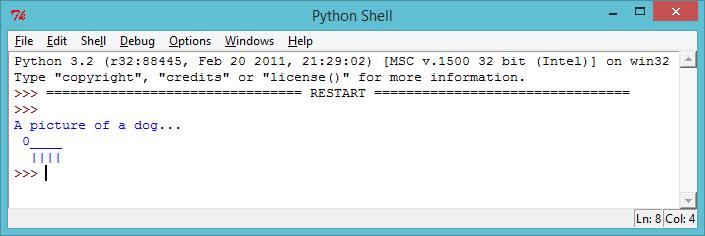
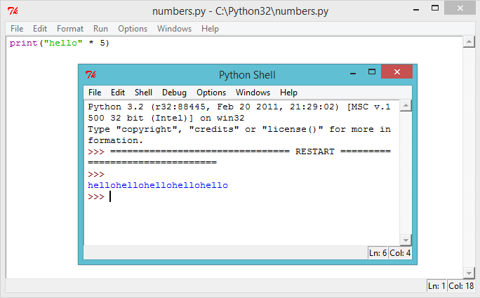
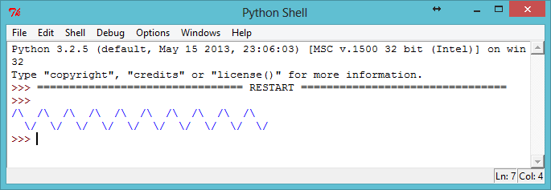

#소개:  { .intro}

파이썬은 명령들을 유용한 프로그램이나 재미있는 게임으로 변환시켜줄 수 있게합니다! 이 프로젝트에선 파이썬 프로그램을 실행하는 방법과 텍스트를 스크린에 표기하는 방법을 배울것입니다.

#1 단계: 안녕이라고 말하기 { .activity}
## 단계별 체크리스트 { .check}

+ 시작으로 굉장히 간단한 프로그램을 써서 파이썬 프로그램을 실행하는 방법을 배워봅시다. IDLE 프로그램 에디터를 열어보세요.
    + 윈도우에선 시작 메뉴에서 IDLE을 찾으세요;
    + 매킨토시에선 Terminal.app을 열고 ‘idle’을 친 후 엔터를 누르세요;
    + 리눅스에선 터미널을 열고 ‘idle’을 친 후 엔터를 누르세요.

+ `File → New Window`를 클릭하고 다음 내용을 나오는 창에 적어 넣으세요:

    ```python
    print("Hello, how are you?")
    ```

    이 프로그램은 스크린에 텍스트를 표기할 것입니다. 표기하려는 텍스트가 따옴표(`"`)로 둘러 쌓여 있는 점에 유의해주세요. 다음 이미지에서 다음 해야 할 행동을 보여줍니다:

    

+ `File → Save`를 클릭해서 파일을 저장하고 파일 이름을 `hello.py` 나 비슷한 제목으로 지으세요. 파일 이름 마지막에 `.py` 를 적는걸 잊지 마세요. 이것은 컴퓨터에게 이 파일이 파이썬 파일이란 것을 알려줍니다. 저게 없으면 프로그램에서 굉장히 유용한 color code가 작동 되지 않습니다.


    

+ `Run → Run Module`를 클릭해서 파일을 실행하세요. 나타나는 다른 창은 Python Shell 입니다. 프로그램은 이 창에서 실행될 것입니다. 제대로 작동했다면 써둔 텍스트가 스크린에 표기되는걸 볼 수 있습니다.


    

+ 따옴표(`"`)를 까먹는 등의 실수를 했다면 무엇이 잘못 됬는지 알려주는 에러 메시지가 표기될것입니다. 시험해보세요!

    

+ 축하합니다, 이제 당신은 파이썬 프로그래머 입니다! 스스로 등을 두드려 칭찬해주거나 귀찮다면 다른사람에게 시키세요!

## 프로젝트를 저장하세요 {save}

## 도전과제: 무슨 생각을 하고 있나요? { .challenge}
위의 프로그램을 수정해서 좀더 재미있는 내용을 스크린에 표기해보세요!


## 프로젝트를 저장하세요 {.save}

#2 단계: 당신에 대해서 { .activity .new-page}
## 단계별 체크리스트 { .check}

+ 이번엔 단순한 텍스트보다 더 재미있는걸 표기해봅시다… 아스키 아트 말이죠! 아스키 아트란 텍스트를 이용해 그림을 만드는 것입니다. 다음은 예시입니다 – 개를 그려본것이죠!

    

    이 작품을 만드려면 다음 내용은 IDLE 에디터에 넣고 프로그램을 실행해보세요:

    ```python
    print("A picture of a dog...")
    print(" 0____  ")
    print("  ||||  ")
    ```

+ 원하신다면 작은 따옴표 3개 (`'''`) 를 따옴표 대신 쓸 수 있습니다. 이것은텍스트 여러 줄을 1개의 print statement로 표기할 수 있게 해줍니다. 다음과 같이요:

    ```python
    print('''
    A picture of a dog...
     0____
      ||||
    ''')
    ```

    이 프로그램을 실행하면 이전과 똑같은 개 그림이 표기되는 것을 볼 수 있습니다..

## 프로젝트를 저장하세요 {.save}

## 도전과제: 당신에 대해서{ .challenge}
텍스트와 아스키 아트를 이용해 파이썬으로 자신에 대한 이야기를 써주세요. 취미나 친구, 가족 등 원하는 무엇이던 그려볼 수 있습니다! 다음은 예시입니다:


## 프로젝트를 저장하세요 {.save}

#3 단계: 텍스트 계산하기 { .activity}
## 단계별 체크리스트 { .check}

+ 파이썬은 또한 텍스트로 계산을 실행할 수 있습니다! `"hello"` 를 5로 곱하면 무엇이 나올까요? 이 프로그램을 실행해서 파이썬에 물어봅시다:

    ```python
    print("hello" * 5)
    ```

    프로그램의 별표 `*`는 곱하기 사인입니다. 위의 프로그램을 실행시키면 다음 답을 볼것입니다:

    

+ 프로그램의 `"hello"` 란 단어 뒤에 스페이스를 넣어서 표기된 텍스트를 더 보기 쉽게 만들 수 있습니다:

    ```python
    print("hello " * 5)
    ```

    이 프로그램을 실행시켜보면 답이 이전보다 좀 더 읽기 쉬워진걸 느낄것입니다.

+ 만약 `"hello "` 곱하기 5 가 `"hello hello hello hello hello "` 라면`"hello" - 7`의 답은 무엇일까요? 이 계산식이 계산이 가능하긴 한가요?


    

    이런 오류가 나 버렸네요! 답 대신 에러 메시지가 표기됩니다. 저 계산 식은 파이썬에선 이해가 안되는 계산 식인가 보군요!

+ 더하기는 어떨까요? `"hello " +  "world`" 의 답은 무엇이라고 생각하시나요? 프로그램을 실행시켜서 찾아보세요:

    ```python
    print("hello " + "world")
    ```

    

    예상했던 답이 나오나요?

## 프로젝트를 저장하세요{.save}

## 도전과제: 단어와 숫자{ .challenge}
다음 프로그램들은 스크린에 무엇을 표기하나요? 실행하기 전에 답을 예상할 수 있을지 보세요.

```python
print("ha "*4)
print("ba" + "na"*2)
print("He" + "l"*2 + "o" + "!"*10)
```

직접 단어를 만들어 넣을 수 있나요?

## 프로젝트를 저장하세요 {.save}

#4 단계: 아스키 패턴{ .activity}
## 단계별 체크리스트 { .check}

+ 이제 텍스트로 계산하는 방법을 배웠으니 무엇을 해야할까요? 왜 그 기능이 쓸모 있을까요? 아스키 아트로 길이 30글자에 높이 3글자의 직사각형을 만들고 싶다고 가정해봅시다. 다음과 같이 어렵게 그리거나:

    ```python
    print("##############################")
    print("##############################")
    print("##############################")
    ```

    혹은 다음과 같이 간단하게 그릴 수 있습니다:

    ```python
    print("#" * 30)
    print("#" * 30)
    print("#" * 30)
    ```

    양쪽 다 같은 직사각형을 스크린에 표기합니다:


    

+ 또한 계산을 통해서 이 파도와 같은 흥미로운 패턴을 만들 수 도 있습니다:

    ```python
    print("/\  "*10)
    print("  \/"*10)
    ```

    

## 프로젝트를 저장하세요 {.save}

## 도전과제: 스카프를 코드 해 보세요 { .challenge}
친한 친구의 11살 생일에 이 스카프를 코드 해 선물 하기로 했다고 생각해보세요! 가능한 부분에는 계산식을 사용해서 자신만의 스카프 패턴을 만들어보세요.


또한 좋아하는 친구라면 케이크(촛불 11개와 함께)를 함께 그려줄 수 도 있습니다!


## 프로젝트를 저장하세요{.save}
