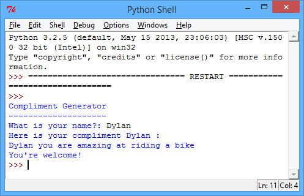
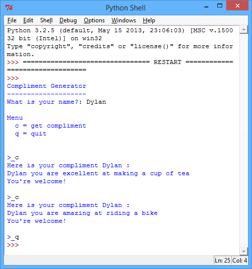
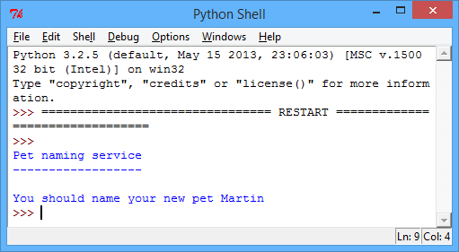

#소개:  { .intro}

리스트를 사용하는 방법을 배우고 변수 하나에 여러 개의 데이터 저장하는 방법을 배웁니다.

#1 단계: 친절한 게 좋은 겁니다 { .activity}

이 프로젝트에선 유저에게 무작위로 생성된 칭찬을 해주는 프로그램을 만들 것 입니다!

## 단계별 체크리스트{ .check}

+ 지금까지의 프로젝트 들에선 변수에 이름이나 점수 같은 하나의 데이터를 저장해 왔습니다. 하지만 여러가지 데이터를 저장하려면 어떻게 해야 될까요? 파이썬에선 _리스트_를 사용하여 여러개의 데이터를 한 변수 안에 저장할 수 있습니다:

    ```python
    bigPlanets = [ "jupiter" , "saturn" , "uranus" , "neptune"]
    ```

    이 텍스트 리스트는 또한 텍스트의 _array(배치)_ 라고도 불립니다. 리스트에 있는 항목에 접속하려면 그 항목의 위치를 알기만 하면 됩니다. 프로그램을 직접 실행 해 보면 더 잘 이해할 수 있습니다:

    ```python
    bigPlanets = [ "jupiter" , "saturn" , "uranus" , "neptune"]
    print( bigPlanets )
    print( bigPlanets[0] )
    print( bigPlanets[1] )
    print( bigPlanets[2] )
    print( bigPlanets[3] )
    ```

    

    여기서 볼 수 있는 것처럼 위치는 1이 아니라 0에서 시작합니다. 그렇기 때문에 `bigPlanets[1]` 은 “Jupiter”(첫번째 항목)이 아닌 "saturn" (두번째 항목)입니다.


+ `compliments`란 리스트를 만들어서 칭찬 생성 프로그램이 선택할 칭찬들을 모두 저장할 수 있고 `choice(compliments)`를 사용해서 유저에게 무작위 칭찬을 선택해주게 만들어 주세요:

    ```python
    from random import *

    print("Compliment Generator")
    print("--------------------")

    compliments = [ "Great job on that thing you did. Really super." ,
                    "You have really really nice programming skills." ,
                    "You make an excellent human."
                  ]

    #'compliments' 리스트에서 무작위 항목 표기하기
    print(choice(compliments))
    print("You're welcome!")
    ```

    

+ 2개의 다른 리스트에서 항목들을 합치게 만들면 칭찬을 좀더 다채롭게 만들 수 있습니다:

    ```python
    from random import *

    print("Compliment Generator")
    print("--------------------")

    adjectives = [ "amazing" , "above-average" , "excellent" ]
    hobbies = [ "riding a bike" , "programming" , "making a cup of tea" ]

    name = input("What is your name?: ")
    print( "Here is your compliment" , name , ":" )

    #두 리스트에서 무작위 항목을 받아와서 합치기
    print( name , "you are" , choice(adjectives) , "at" , choice(hobbies) )
    print( "You're welcome!" )
    ```

    

## 프로젝트를 저장하세요{.save}

## 도전과제: 칭찬 종류 추가하기 { .challenge}
더 많은 종류의 칭찬을 생각해내고 프로그램에 더해보세요! 리스트의 항목 사이엔 콤마 (`,`) 를 넣어야 한다는 걸 잊지 마세요.

## 프로젝트를 저장하세요 {.save}

#2 단계: 끝없는 칭찬들 { .activity}

## 단계별 체크리스트 { .check}

+ `while` 루프와 `if` statements에 대해 아는 것을 응용해서 프로그램을 수정해 프로그램을 유저가 끝낼 때 까지 계속해서 칭찬을 하게 만들어보세요.

    ```python
    from random import *

    #이 변수가 `True`인 이상 프로그램은 루프합니다
    running = True

    adjectives = [ "amazing" , "above-average" , "excellent" ]
    hobbies = [ "riding a bike" , "programming" , "making a cup of tea" ]

    print("Compliment Generator")
    print("--------------------")

    name = input("What is your name?: ")

    print('''
    Menu
      c = get compliment
      q = quit
    ''')

    while running == True:

        menuChoice = input("\n>_").lower()

        #'c' for a compliment
        if menuChoice == 'c':

            print( "Here is your compliment" , name , ":" )

            # 두 리스트에서 무작위 항목을 받아와서 합치기
            print( name , "you are" , choice(adjectives) , "at" , choice(hobbies) )
            print( "You're welcome!" )

        #'q' 로 종료하기
        elif menuChoice == 'q':

            running = False

        else:

            print("Please choose a valid option!")
    ```

    

 `while` 루프는 변수 `running` 이 `True`로 지정되어 있는 동안은 계속해서 지속된다는 걸 기억하세요. 유저가 `q`를 입력해서 종료하면 `running` 은 `False`가 됩니다.

## 프로젝트를 저장하세요 {.save}

#3단계: 칭찬 종류 개량하기 { .activity}

## 단계별 체크리스트 { .check}

+ 칭찬 생성기가 슬슬 자리를 잡아가지만 아직 문제가 있습니다: 만약 유저가 자전거를 못 타거나 차를 끓일 수 없다면 어쩌죠? 그렇다면 칭찬이 그 사람에겐 틀린 말이 되고 의미도 없을 것 입니다!

    프로그램을 수정해서 유저가 `hobbies` 리스트에서 항목들을 더하거나 뺄 수 있도록 만들어서 받는 칭찬을 자신에게 맞게 개량할 수 있게 합시다:


    ```python
    from random import *

    running = True
    adjectives = [ "amazing" , "above-average" , "excellent" ]
    hobbies = [ "riding a bike" , "programming" , "making a cup of tea" ]

    print("Compliment Generator")
    print("--------------------")

    name = input("What is your name?: ")

    print('''
    Menu
      c = get compliment
      a = add hobby to list
      d = delete hobby from list
      p = print hobbies
      q = quit
    ''')

    while running == True:

        menuChoice = input("\n>_").lower()

        #'c' 는 칭찬이란 뜻입니다
        if menuChoice == 'c':

            print( "Here is your compliment" , name , ":" )

            # 두 리스트에서 무작위 항목을 받아와서 합치기
            print( name , "you are" , choice(adjectives) , "at" , choice(hobbies) )
            print( "You're welcome!" )

        #'a' 로 취미를 더합니다
        elif menuChoice == 'a':

            itemToAdd = input("Please enter the hobby to add: ")
            hobbies.append(itemToAdd)

        #'d' 로 취미를 지웁니다
        elif menuChoice == 'd':

            itemToDelete = input("Please enter the hobby to remove: ")
            hobbies.remove(itemToDelete)

        #'p' 로 취미 리스트를 표기합니다
        elif menuChoice == 'p':
            print(hobbies)

        #'q' 로 종료합니다
        elif menuChoice == 'q':

            running = False

        else:

            print("Please choose a valid option!")
    ```

    볼 수 있듯이 `append()`로 리스트에 항목을 더하고 `remove()`로 뺄 수 있습니다. 이 프로그램을 실행하고 취미를 자신에 맞게 바꿔보세요. 기분이 좋아질 때까지 칭찬하게 해보세요!

+ 위의 프로그램을 시험할 때 문제가 있었 나요? 지금은 칭찬 생산기에 없는 칭찬을 빼려고 하면 프로그램에 오류가 생깁니다:

    

    이 문제를 고치려면 먼저 빼려는 항목이 리스트에 있는지 확인하게 만들면 됩니다. 취미를 빼는 코드를 이 코드로 바꿔 넣으세요:

    ```python
        #'d' 로 취미를 지웁니다
        elif menuChoice == 'd':

            itemToDelete = input("Please enter the hobby to remove: ")
            #only remove an item if it's in the list
            if itemToDelete in hobbies:
            	hobbies.remove(itemToDelete)
            else:
            	print("Hobby not in list!")
    ```

    다시 프로그램을 실행해보고 리스트에 없는 취미를 빼려고 해보세요:

    

## 프로젝트를 저장하세요{.save}

## 도전과제: 중복된 취미항목 { .challenge}
이 프로그램의 또 다른 문제는 같은 취미를 한번 이상 더할 수 있다는 겁니다:


이 문제를 고쳐서 취미가 리스트에 없는 경우에만 추가할 수 있게 만들 수 있나요:

```python
if itemToAdd not in hobbies:
	#add code here...
```

## 프로젝트를 저장하세요{.save}

## 도전과제: 애완동물 이름 짓기 { .challenge}
새 애완동물 주인이 애완동물에게 이름을 짓는데 도움이 될 프로그램을 짜보세요:



당신의 프로그램은:
+ 유저가 리스트에서 이름을 더하거나 뺄 수 있게 해야 합니다;
+ 수컷과 암컷 애완동물, 또는 다른 종류의 동물에게 다른 이름을 줄 수 있게 해야 합니다;
+ 유저가 하나 이상의 애완동물이 있을 경우를 위해 몇 개의 이름이 필요한지물을 수 있어야 합니다.

## 프로젝트를 저장하세요{.save}
