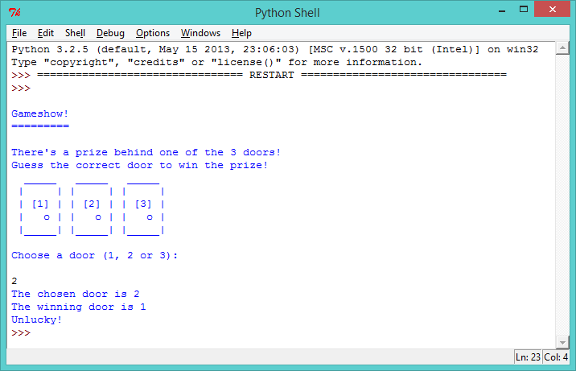
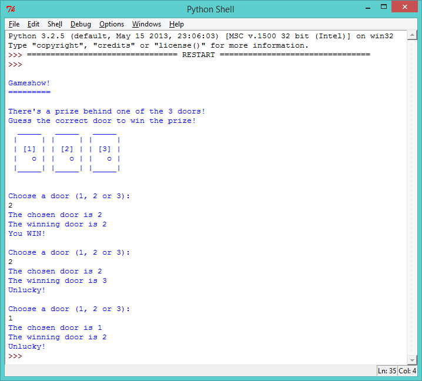
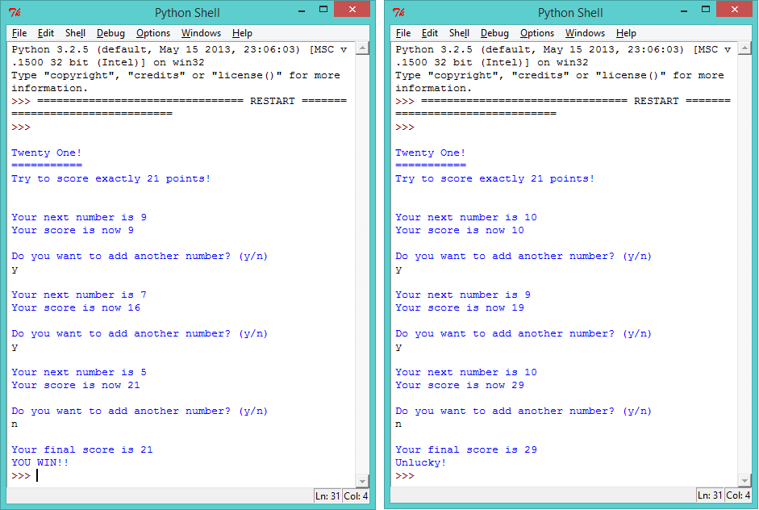

#소개: { .intro}

이 프로젝트에선 어느 문 뒤쪽에 보상이 있는지를 예상해야 하는 추측 게임을 만들 것입니다.

#1 단계: 문 뒤엔 무엇이 있을까? { .activity}
## 단계별 체크리스트{ .check}

+ 3개의 문 중 하나의 뒤에 굉장한 상품이 있는 게임쇼가 있다고 상상해 보세요. 문을 잘 선택하면 상품을 받을 수 있지만 잘못 선택하면 아무것도 받지 못합니다!

    이 게임은 다음 프로그램을 실행시켜서 해볼 수 있습니다:

    ```python
    from random import *

    #문 3개와 게임 방법을 표기합니다
    print('''
    Gameshow!
    =========

    There's a prize behind one of the 3 doors!
    Guess the correct door to win the prize!
      _____   _____   _____
     |     | |     | |     |
     | [1] | | [2] | | [3] |
     |   o | |   o | |   o |
     |_____| |_____| |_____|

    Choose a door (1, 2 or 3):
    ''')

    #정한 문 번호를 받고 정수로 저장합니다
    chosenDoor = input()
    chosenDoor = int(chosenDoor)

    #맞는 문 번호를 무작위로 선택합니다(1에서 3 사이에서)
    winningDoor = randint(1,3)

    #플레이어가 선택한 번호와 맞는 문 번호를 보여줍니다
    print("The chosen door is", chosenDoor)
    print("The winning door is", winningDoor)

    #선택한 문과 맞는 문 번호가 같다면 플레이어가 승리합니다
    if chosenDoor == winningDoor:
        print("Well done!")
    else:
        print("Unlucky!")

    ```

    

    프로그램이 작동하는 방법은 이렇습니다: 먼저 1에서 3 사이의 난수가 선택돼서 어느 문 뒤에 상품이 있을지 정해집니다. 여기서 `randint(1,3)` 의 뜻은  '1에서 3 사이의 정수를 선택하기'입니다. 그 후에 프로그램은 플레이어에게 문을 선택하게 만들고 숫자가 같다면 "Well done!"이라고 표기하고 다르다면 "Unlucky!" 라고 표기합니다.

    난수는 매번 다른 문 뒤에 상품이 있게 만들어줍니다. 하지만 파이썬은 난수를 만드는 코드를 따로 들여오지 않고는 난수를 만들 수 없습니다. 그렇기 때문에 `random` 라이브러리가 프로그램 가장 위에 들여와집니다.

 `#` 으로 시작하는 줄들은 주석들 입니다. 주석들은 파이썬에선 무시하지만 프로그램이 무엇을 하고있는지 알려주는데 매우 중요한 역할을 합니다! 이제부터 코드를 쓰는데 주석을 사용해서 프로그램의 어려운 부분들은 더 쉽게 이해할 수 있게 만들어보세요.

+ 루프에 대해 배운 것을 사용해 플레이어가 한번이 아닌 세 번을 선택할 기회를 가질 수 있게 만들 수 있습니다. 다음 프로그램을 실행해보세요:

    ```python
    from random import *

    # 문 3개와 게임 방법을 표기합니다
    print('''
    Gameshow!
    =========

    There's a prize behind one of the 3 doors!
    Guess the correct door to win the prize!
      _____   _____   _____
     |     | |     | |     |
     | [1] | | [2] | | [3] |
     |   o | |   o | |   o |
     |_____| |_____| |_____|
    ''')

    #플레이어에게 세 번의 기회를 줍니다
    for attempt in range(3):

        print("\nChoose a door (1, 2 or 3):")

        #정한 문 번호를 받고 정수로 저장합니다
        chosenDoor = input()
        chosenDoor = int(chosenDoor)

        #맞는 문 번호를 무작위로 선택합니다(1에서 3 사이에서)
        winningDoor = randint(1,3)

        #플레이어가 선택한 번호와 맞는 문 번호를 보여줍니다
        print("The chosen door is", chosenDoor)
        print("The winning door is", winningDoor)

        #선택한 문과 맞는 문 번호가 같다면 플레이어가 승리합니다
        if chosenDoor == winningDoor:
            print("Well done!")
        else:
            print("Unlucky!")

    ```

    

    이 프로그램에선 3개의 문은 한번만 표기되면 되기 때문에 표기하는 코드가 루프 _바깥쪽_이라는 점에 유의해주세요. 난수를 만드는 코드와 플레이어가 문을 고르는 코드는 각각 세번 실행되야 되기 때문에 루프 _안쪽_에 있습니다. 상품 문을 지정하는 코드가 루프 바깥쪽이었다면 세번 다 같은 문 뒤에 상품이 있을 것입니다.

    또한 `print("\nChoose a door (1, 2 or 3):")` 줄의 `\n`은 새로운 빈 줄을 스크린에 표기합니다. 이는 텍스트를 나눠서 더 읽기 쉽게 만들기 위해 있습니다.


## 프로젝트를 저장하세요 {.save}

## 도전과제: 점수 세기{ .challenge}
플레이어가 이기는 문을 몇 번 선택했는지 세는 변수를 만드세요. 도움이 필요하다면 퀴즈 프로그램에서 만들었던 `score`변수와 비슷한 방식이란 걸 기억해 보세요. 플레이어에게 프로그램 끝에(루프 바깥에) 최종 점수가 몇 점인지 보여줄 수 있게 하세요.

## 프로젝트를 저장하세요{.save}

#2 단계: `while` 루프 { .activity}
## 단계별 체크리스트{ .check}

+ 프로그램이 몇 번 루프 할지 정해 두는 것보다 플레이어가 얼마나 오랫동안 시도하고 싶은 지 정하게 만드는게 더 나을지도 모릅니다. 그러려면 `while` 루프라는 다른 종류의 루프가 필요합니다. 다음 프로그램을 시험해보세요:

    ```python
    from random import *

    #유저는 이 변수를 바꿔서 게임을 종료합니다
    playing = True

    score = 0

　　# 문 3개와 게임 방법을 표기합니다
    print('''
    Gameshow!
    =========

    There's a prize behind one of the 3 doors!
    Guess the correct door to win the prize!
      _____   _____   _____
     |     | |     | |     |
     | [1] | | [2] | | [3] |
     |   o | |   o | |   o |
     |_____| |_____| |_____|
    ''')

    #플레이어에게 세 번의 기회를 줍니다
    for attempt in range(3):

        print("\nChoose a door (1, 2 or 3):")

        #정한 문 번호를 받고 정수로 저장합니다
        chosenDoor = input()
        chosenDoor = int(chosenDoor)

        #맞는 문 번호를 무작위로 선택합니다(1에서 3 사이에서)
        winningDoor = randint(1,3)

        #플레이어가 선택한 번호와 맞는 문 번호를 보여줍니다
        print("The chosen door is", chosenDoor)
        print("The winning door is", winningDoor)

        #선택한 문과 맞는 문 번호가 같다면 플레이어가 승리합니다
        if chosenDoor == winningDoor:
            print("Well done!")
        else:
            print("Unlucky!")

        print("Your score is now", score)

        #플레이어에게 계속 시도하고 싶은 지 물어봅니다
        print("\nDo you want to play again? (y/n)")
        answer = input()
        #플레이어가 `n`이라고 입력하면 게임을 종료합니다
        if answer == 'n':
            playing = False

    print("Thanks for playing.")
    print("Your final score is", score)
    ```

    

    `while` 루프는 무언가 프로그램을 멈출 때까지 프로그램을 반복시키는 루프입니다. 이 프로그램에선 `playing` 변수가`True`인 한 계속해서 반복되게 만들어야 합니다. 플레이어가 더 이상 시도하기 싫다면 `n`을 입력하면 `playing` 변수가 `False`가 되어 루프가 멈춥니다. `True` 나 `False`만 있는 데이터는 _부울(Boolean)_식 데이터라고 불립니다.

+ 게임을 시험해서 `n`을 입력할 때까지 게임을 반복해서 시도가능한지 확인하세요.


## 도전과제: 입력 개선하기 {.Challenge}
+ 플레이어가 `n`대신 `N`을 입력하면 어떻게 되나요? `lower()` 기능으로 이 문제를 고칠 수 있겠 나요?

+ `n`대신 `no`를 입력하면 어떻게 되나요`? 문제를 고쳐서 유저가 `answer == 'n' 이나 answer == 'no'`를 눌러도 종료되도록 만들 수 있나요?

## 도전과제: 게임 패배{ .challenge}
게임을 수정해서 플레이어의 틀린 문을 고를 때 마다 점수가 0이 되게 만들 수 있나요? 이 수정이 게임을 더 재미있게 만드나요 혹은 너무 어렵게 만드나요?

#3 단계: 얼마나 운이 좋으신 가요? { .activity}
## 단계별 체크리스트 { .check}

+ 플레이어가 그만둘 때까지 게임을 루프 하는 대신 플레이어가 3점을 얻을 때 까지만 루프 하게 만들 수 있습니다. 그러면 게임의 목표는 가장 적은 시도로 가장 빨리 3점을 얻으려고 하는 것이 되겠죠:

    ```python
    from random import *

    #이 변수는 게임이 몇 번 시도 ‰榮쩝 저장합니다
    attempts = 0

    score = 0

    #3개의 문과 게임 방법을 표기합니다
    print('''
    Gameshow!
    =========

    There's a prize behind one of the 3 doors!
    Guess the correct door 3 times in as few attempts as possible!
      _____   _____   _____
     |     | |     | |     |
     | [1] | | [2] | | [3] |
     |   o | |   o | |   o |
     |_____| |_____| |_____|
    ''')

    #점수가 3 이하인 이상 계속 반복합니다
    while score < 3:

        #시도 횟수에 1을 더합니다
        attempts = attempts + 1

        print("\nAttempt", attempts, ": Choose a door (1, 2 or 3):")

#정한 문 번호를 받고 정수로 저장합니다
        chosenDoor = input()
        chosenDoor = int(chosenDoor)

        #맞는 문 번호를 무작위로 선택합니다(1에서 3 사이에서)
        winningDoor = randint(1,3)

        #플레이어가 선택한 번호와 맞는 문 번호를 보여줍니다
        print("The chosen door is", chosenDoor)
        print("The winning door is", winningDoor)

        #선택한 문과 맞는 문 번호가 같다면 플레이어가 승리합니다
        if chosenDoor == winningDoor:
            print("Well done!")
        else:
            print("Unlucky!")

        print("Your score is now", score)

    print("\n** You did it! That look you", attempts, "attempts **")
    ```

    프로그램의 `while` 루프는 점수가 3점 이하인 경우엔 계속해서 실행됩니다 (`while score < 3:`). 점수가 3점이 되면 프로그램이 종료되고 시도횟수가 표기됩니다.

## 프로젝트를 저장하세요{.save}

## 도전과제: 21 { .challenge}
정확히 21점을 얻어야 하는 게임을 만들 수 있겠 나요? 이 프로그램에선 1에서 10 사이의 난수를 고르고 플레이어의 점수에 더해야 합니다. 그 후 플레이어는 그 점수를 그대로 두거나 다른 난수를 더할 수 있습니다. 플레이어가 정확히 21점을 얻으면 승리합니다. 프로그램을 쓸 때 주석을 더해 두는 것을 잊지 마세요!

게임의 예시 입니다:



게임 쇼 프로그램의 일부를 사용(혹은 수정)해서 이 새 게임을 만들 수 있습니다. 다음은 게임을 만들 때 필요할 만한 몇가지 힌트들입니다:

+ `while` 루프를 사용해서 플레이어가 원할 때까지 게임을 계속할 수 있습니다.:

```python
while playing == True:
```

+ 유저가 점수를 그대로 두기 위해 `n`을 누른다면 `playing` 변수를 `False`로 지정합니다:

```python
if answer == 'n':
    playing = False
```

+ 프로그램 끝부분에 (`while` 루프 바깥쪽에), 플레이어의 점수가 정확히 21이면 "Well done!"이라는 메시지가 나오게 할 수 있습니다:

```python
if score == 21:
    print("Well done!")
```

## 프로젝트를 저장하세요 {.save}
