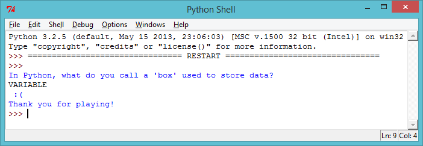

# 소개:  { .intro}

이 프로젝트에선 당신의 친구들에게 도전하게 만들 퀴즈 게임을 만들어 볼 것입니다.

# 1 단계: 질문 묻기 { .activity}

## 단계별 체크리스트 { .check}

+ 먼저 플레이어에게 질문을 한 뒤 답을 맞추면 스마일 아이콘을 보여주는 간단한 퀴즈프로그램을 만들어 봅시다.

	```python
	print("In Python, what do you call a 'box' used to store data?")
	answer = input()

	if answer == "variable":
		print(" :) " * 100)

	print("Thank you for playing!")
	```

	`if answer == "variable":` 줄 뒤에 콜론(`:`)을 더하는 걸 잊지 마시고 밑에 줄은 인덴트 해서(오른쪽으로 움직이세요) 앞에 자리를 만들어 주세요.

+ 저 프로그램 코드를 쓰셨으면 이제 시험해보세요! 답을 맞췄을 땐 어떻게 되나요? 틀렸을 때는 요?

	

	의도 했던 코드(스마일 아이콘을 띄우는)는 답이 맞을 때만 나와야 합니다. 하지만 "Thank you for playing!" 은 답이 맞던 틀리던 언제나 출력됩니다. 왜 일까요?

	파이썬은 두개의 등호 `==`를 사용해서 두가지가 같은 가를 확인합니다. 이것은 등호 하나`=`는 변수에 데이터를 저장하기 위해 사용되기 때문이죠 (예를 들어 `answer = input()`).

+ 위의 프로그램은 플레이어가 답을 맞추면 스마일 아이콘을 표기하지만 틀렸을 땐 틀렸다고 해줄 무언가를 표기하지 않습니다. 이럴 땐 `else` statement 를 사용해서 답 외의 무언가를 입력하면 슬픈 아이콘을 표기하게 만들면 됩니다.

	```python
	print("In Python, what do you call a 'box' used to store data?")
	answer = input()

	if answer == "variable":
		print(" :) " * 100)
	else:
		print(" :( " * 100)

	print("Thank you for playing!")
	```

	이 프로그램을 다시 시험해보세요. 바른 답을 입력했을 땐 어떤 가요? 틀린 답을 적었을 땐 어떤 가요?

	

## 프로젝트를 저장하세요 {.save}

## 도전과제: 질문 시간 { .challenge}

지금까지 배운 기술들로 직접 퀴즈를 만들어보세요. 질문은 원하는 어떤 종류여도 괜찮지만 `if`와 `else` statement를 사용할 수 있는 질문이어야 합니다.

## 프로젝트를 저장하세요 {.save}

# 2 단계: 시험해보기 { .activity}

프로그램이 바르게 작동하는지 확인 하는 건 언제나 중요합니다.

## 단계별 체크리스트 { .check}

+ 퀴즈를 시험하다 보면 가끔 바른 답을 입력했는데도 틀렸다고 하는 걸 볼 수 있을 겁니다. CAPS LOCK을 눌렀을 때 처 럼요.

	

	이건 파이썬이 굉장히 깐깐한 프로그램이기 때문입니다. 파이썬에선 “v”가 “V”와 다른 문자로 인식 되기 때문에 실수로라도 대문자를 사용했다면 그 답이 오답이라고 생각하는 것입니다.

	게임에서 이 대문자 소문자 구분을 시험해보세요.

+ 이 문제를 고치려면 플레이어의 입력을 모두 소문자로 인식하게 만들어야 합니다. 그러려면 수정된 답이 출력되게 만들어야 하죠. 플레이어가 답을 입력하는 부분을 이렇게 고치세요:

	```python
	answer = input().lower()
	print(answer)
	```

+ 이제 퀴즈를 다시 시험해보세요. 문제가 고쳐졌나 요? 다음 예시 문제들을 시험해보세요:

	

## 프로젝트를 저장하세요 {.save}

# 3 단계: 객관식 문제 { .activity}

## 단계별 체크리스트 { .check}

+ 지금까진 `if` 와 `else`를 써서 플레이어의 답이 맞았나 틀렸 나를 확인했습니다. 하지만 4가지 답 중 하나를 골라야 하는 객관식 문제가 있다면 어떻게 해야 할까요? 이럴 땐 `elif` statement를 사용하면 됩니다.

	```python
	print('''
	Q1 - In Python, what do you call a 'box' used to store data?
	a - text
	b - variable
	c - a shoe box
	''')
	answer = input().lower()

	if answer == "a":
		print(" Nope - text is a type of data :( ")
	elif answer == "b":
		print(" Correct!! :) ")
	elif answer == "c":
		print(" Don't be silly! :( ")
	else:
		print(" You didn't choose a, b or c :( ")
	```

	`elif` 는 “else if”의 줄임 말입니다. 저 위에서 쓴 프로그램에선 플레이어가 고른 답에 따라 4개의 메시지 중 하나를 보여주는 것이죠.

+ 코드를 퀴즈에 더해서 객관식 문제를 만들어보세요.

+ 이 문제를 4번 시험해서 네 개의 메시지를 각각 확인 해보세요.

	

## 프로젝트를 저장하세요 {.save}

## 도전과제: 객관식 퀴즈{ .challenge}

객관식 문제를 몇 개 더 프로그램에 추가해보세요. 퀴즈를 완성했으면 누군가에게 플레이 하게 해보세요. 재미 있게 했다고 하나요? 너무 어렵거나 쉽지 않았 나요?  

## 프로젝트를 저장하세요 {.save}

## 도전과제: 점수 세기 { .challenge}

`score` 변수를 사용해서 플레이어의 점수를 셀 수 있겠 나요? 변수는 이렇게 사용되야 합니다:

+ 프로그램이 시작될 때 점수를 0으로 만드세요.
+ 질문의 답을 맞출 때마다 점수를 1점씩 더하세요. (`score = score + 1`)
+ 퀴즈 마지막에 플레이어의 점수를 출력하세요.

## 프로젝트를 저장하세요 {.save}

## 도전과제: 얼마나 잘 했 나요? { .challenge}

게임 끝에 개인화된 메시지를 출력시킬 수 있겠 나요?

+ 모든 질문을 맞췄다면 "well done" `이라고 출력되게 만드세요.
+ `else` 무엇이라도 틀렸다면 "try again" 이 출력되게 만드세요.

(어느 메시지를 표기할 지엔 `score` 변수를 사용해야 합니다!)

## 프로젝트를 저장하세요 {.save}
