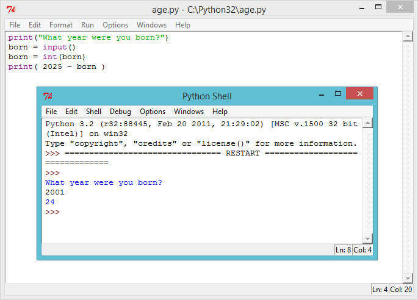
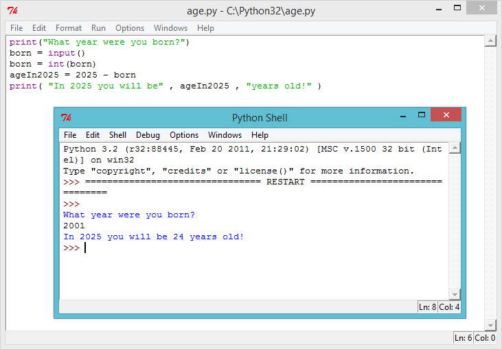

#소개:  { .intro}

이 프로젝트에선 당신이 2025년에 몇 살이 될지 알려주는 프로그램을 만들 것입니다!

#1 단계: 얼마나? { .activity}
## Activity Checklist { .check}

+ 파이썬에서 출력할 수 있는 건 텍스트뿐 만이 아닙니다. 숫자 또한 스크린에 출력 시킬 수 있습니다. 예를 들어 친구들 8명이 £2씩을 침묵의 날을 위해 기부했다면 이 프로그램을 사용해서 돈을 얼마나 모았는지 볼 수 있습니다:

	```python
	print(8*2)
	```

　　　　위 프로그램의 별표 `*` 는 곱하기 사인입니다. 그러니 프로그램은 답을 8 x 2로 출력하겠죠.

+ 위의 프로그램을 실행시키면 답을 볼 수 있습니다:

	

## 프로젝트를 저장하세요 {.save}

## 도전과제: 잔돈 { .challenge}
파이썬 프로그램을 써서 차를 한대 씻어주는데 £2.50씩 받고 12대를 씻었다면 얼마를 벌었을 지 계산해보세요.

## 프로젝트를 저장하세요 {.save}

#2 단계: 몇 살인가요? { .activity}
## 단계별 체크리스트 { .check}

+ 지금까지 배운 것들을 응용하면 당신이 2025년에 몇 살이 될지 계산하는 프로그램을 짤 수 있을 것입니다. 이 나이를 계산하는 프로그램은 이렇게 작동해야 할 것입니다:

	

	볼 수 있듯이 2004년에 태어났다면 2025년의 나이를 `2025 - 2004`로 계산 할 수 있습니다. 즉 2004년에 태어난 사람은 2025년엔 21살이 되겠죠! 2004년에 태어난 게 아니라면 프로그램의 숫자를 바꾸세요.

## 프로젝트를 저장하세요. {.save}

## 도전과제: 날짜 바꾸기 { .challenge}
프로그램을 바꿔서 1998년도에 태어난 사람이 2025년에 몇 살이 될지를 계산해 보세요. 2050년도엔 몇 살일까요?

## 프로젝트를 저장하세요 {.save}

#3 단계: 변수 { .activity }

위의 도전과제들을 할 때 다른 나이의 사람이 다른 년도에 될 나이를 계산할 때 계속해서 프로그램의 숫자를 바꿔야 했을 겁니다. 누군가에게 몇 년도에 태어났는지 묻고 바로 그 답을 계산에 쓸 수 있다면 훨씬 편할 것입니다. 변수는 이럴 때 사용합니다.

## 단계별 체크리스트 { .check}

+ 이 파이썬 프로그램을 실행하세요:

	```python
	print("What year were you born?")
	born = input()
	born = int(born)
	print( 2025 - born )
	```

	이 프로그램은 태어난 년도를 입력 하는 걸 기다리고 입력 후 엔터를 치면 2025년도의 나이를 보여줍니다:

	

	이 프로그램은 `input()` 함수를 사용해서 유저가 키보드로 입력한 데이터를 받고 'born'이라는 변수에 저장합니다. 변수란 중요한 데이터를 저장하는 박스라고 생각할 수 있습니다.

	

	이 변수 (박스) 가 "born"이라고 이름 지어 져 어떤 데이터를 저장하는지 알기 쉽게 만들어졌다는데 주의해주세요!

	이 줄...

	```python
	print( 2025 - born )
	```

	...은 `born` 변수에 저장된 숫자를 2025에서 뺍니다.

	키보드로 입력한 내용은 언제나 텍스트로 저장됩니다. 그렇기 때문에 `int()` 함수를 사용해서 유저가 입력한 데이터를 언제나 정수로 변환시키도록 해야 합니다.

+ 유저에게 도움이 되는 메시지를 더해서 프로그램을 훨씬 더 쉽게 이해 할 수 있게 만들 수 있습니다. 프로그램의 마지막 줄을 이렇게 바꾸세요:

	```python
	print( "In 2025 you will be" , 2025 - born , "years old!" )
	```

+ 프로그램을 다시 실행해서 어떻게 바뀌었는지 확인해보세요.

	

+ 여기서 멈출 이유는 없죠. 또다른 변수를 사용해서 답을 표기하기전에 저장해둘 수 있습니다. 이 프로그램을 실행해보세요:

	

## 프로젝트를 저장하세요 {.save}

## 도전과제: 3000년도! { .challenge}
이 프로그램은 2025년에 몇 살이 될 것인지만 알려줍니다. 만약 누군가 2050년도의 자신의 나이가 알고 싶다면 요? 혹은 3000년엔요? 다른 변수를 프로그램에 더해서 유저가 원하는 년도에 몇 살일지 알려주는 프로그램을 만들어 보세요.


## 프로젝트를 저장하세요 {.save}

## 도전과제: 당신의 나이는 개 나이로? { .challenge}
유저에게 나이를 물어보고 그 나이를 개 나이로 보여주는 프로그램을 만들어 보세요. 사람의 나이를 개 나이로 변환하려면 7로 곱하면 됩니다.


