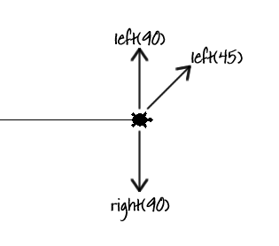

#소개:  { .intro}
이 프로젝트에선 `거북이`를 사용해서 멋진 모양과 패턴을 그려볼 것입니다.

#1 단계: 거북아 안녕! { .activity}

재미있게 거북이를 프로그래밍 해볼 것입니다. 거북이란 파이썬 커맨드로 조종할 수 있는 스크린에 그림을 그리는 조그마한 로봇입니다.

## 단계별 체크리스트 { .check}

+ 이 짧은 파이썬 프로그램을 실행시켜서 거북이가 스크린에서 돌아다니게 만들어 봅시다:

	```python
	from turtle import *
	shape("turtle")
	speed(5)

	forward(100)
	right(90)
	forward(100)

	done()
	```

	

+ 거북이엔 펜이 달려있어서 스크린에서 움직일 때 선을 그리고 지나갑니다. 다음은 프로그램의 기능입니다:

	+ `from turtle import *` 는 파이썬에게 스크린에 그릴 때 사용할 수 있는 코드인 거북이 라이브러리를 가져오게 만듭니다. `*`은 전부 가져온다는 뜻입니다.

	+ `shape("turtle")` 은 그림을 그리는 로봇의 모양을 거북이 형태로 만듭니다. 거북이 대신 "arrow", "circle", "square", "triangle" 이나 "classic"을 쓸 수도 있습니다.

	+ `speed(5)` 는 거북이가 얼마나 빨리 움직일 지를 정해줍니다. 1에서 11 사이의 숫자를 사용할 수 있으며 11이 가장 빠르고 1이 가장 느립니다.

	+ `forward(100)` 과 `backward(100)` 은 거북이에게 앞으로 혹은 뒤로 100 픽셀 움직이게 만듭니다.

	+ `left(45)` 와 `right(90)` 은 거북이를 오른쪽이나 왼쪽으로 지정된 각도 만큼 돌아서게 합니다. 몇가지 예시입니다:

		

	+ `done()` 은 파이썬에게 거북이 프로그래밍이 끝났다고 얘기해줍니다.


+ 가장 좋아하는 색이 무엇인가요? 그림을 더 흥미롭게 만들기 위해 줄을 그리는 펜의 굵기와 색을 바꿀 수도 있습니다. 간단한 예시를 시험해보세요:

	```python
	from turtle import *
	shape("turtle")
	speed(8)

	color("Purple")
	pensize(7)
	right(90)
	forward(100)
	left(90)
	forward(50)

	color("Orange")
	pensize(3)
	penup()
	forward(50)
	pendown()
	forward(50)

	done()
	```

	

+ 위의 코드엔 몇가지 새로운 커맨드가 사용됩니다:

	+ `color("Purple")` 은 거북이와 그려지는 선의 색을 보라색으로 바꿉니다. 또한 CSS에서 했던 것처럼 색깔을 *16진수*로 정해 넣을 수도 있습니다. `pencolor("Red")` 대신 `pencolor("#FF0000")`를 사용할 수 있는 것 같이요.

	+ `penup()` 은 스크린에서 펜을 올리고 `pendown()` 은 다시 내립니다. 즉 거북이가 선을 그리지 않고 움직이는 부분을 만들 수 있다는 것입니다!

## 프로젝트를 저장하세요 {.save}

## 도전과제: 모양 그리기 { .challenge}
+ 거북이를 사용해서 다음 모양을 그릴 수 있나요:
	+ 정사각형?
	+ 삼각형?

+ 집을 그려볼 수 있나요? 다른 건 무엇을 그릴 수 있을까요?

## 프로젝트를 저장하세요 {.save}

# 2 단계: 반복하기 { .activity }

정사각형과 삼각형을 그렸을 때 프로그램에서 같은 커맨드를 몇 번씩 반복시켜 사용했죠. 이제 파이썬으로 쉽게 반복시켜봅시다!

## 단계별 체크리스트 { .check}

+ 새 파일을 열고 다음 프로그램을 실행 시켜 보세요:

	```python
	from turtle import *

	speed(11)
	shape("turtle")

	for count in range(4):
		forward(100)
		right(90)

	done()
	```

	이 프로그램은 `for` 루프를 사용하고 있습니다. 파이썬에선 코드를 몇 번씩 반복하고 싶을 때 `for` 루프를 사용하면 됩니다.

	위의 프로그램에선 `forward(100)` 와 `right(90)`이란 커맨드가 4번 반복 실행되어 정 사각형을 그립니다. 한번에 90도씩 네 번 돌면 360도를 돌게 되죠.

+ `if` statement와 마찬가지로 탭 키로 반복하려는 코드를 인덴트 해두세요. 코드를 바꿔서 `forward(100)` 줄은 인덴트 되있지만 `right(50)` 줄은 인덴트 시키지 말아보세요. 이렇게요:

	```python
	from turtle import *

	speed(11)
	shape("turtle")

	for count in range(4):
		forward(100)
	right(90)

	done()
	```

	이 프로그램을 실행시키면 어떻게 되나요? 직선만 그리지 않았 나요? 이 프로그램에선 파이썬이 `forward(100)`을 4번 반복한 _후에나_ `right(90)`도로 돌아갑니다.

+ 이제 커맨드를 반복하는 방법을 배웠으니 복잡한 모양이나 패턴도 쉽게 만들 수 있습니다. 이 프로그램을 실행 해 보세요:

	```python
	from turtle import *

	speed(11)
	shape("turtle")

	for count in range(8):
		forward(100)
		right(45)

	done()
	```

	

	이 프로그램은 정사각형을 만드는 프로그램과 같은 방법으로 작동하지만 코드를 8번 반복하고 매번 45도씩만 돕니다. 즉 이 코드는 45도씩 8번 돌아 360도를 완성시켜 8면이 있는 모양(팔각형)을 만들죠.

+ 여기에 `for`루프를 사용해서 그릴 수 있는 또 다른 프로그램이 있습니다. 이 프로그램은 어떤 모양을 그리나요?

	```python
	from turtle import *

	speed(11)
	shape("turtle")

	for count in range(30):
		forward(5)
		penup()
		forward(5)
		pendown()

	done()
	```

## 프로젝트를 저장하세요 {.save}

## 도전과제: 반복으로 그리는 도형들 { .challenge}
+ `for` 루프를 사용해서 다음 도형을 그릴 수 있나요?:
	+ 오각형? (다섯 면)
	+ 육각형? (여섯 면)
각 모양의 각도가 360도로 더해져야 한다는 점을 잊지 마세요!

+ 원을 그릴 수 있나요? 앞으로 1픽셀 간 1도씩 돌아가야 할 것입니다. 이 커맨드를 몇 번 반복해야 할까요?

## 프로젝트를 저장하세요 {.save}

## 도전과제: 패턴 그리기 { .challenge}
지금까지 배운 기술들로 멋진 패턴들을 그려볼 수 있겠 나요? 몇가지 예시 입니다:

```python
from turtle import *

speed(11)
shape("turtle")
pensize(6)
color("Red")

for count in range(36):
	forward(100)
	right(100)

done()
```


## 프로젝트를 저장하세요 {.save}

## 도전과제: 변수와 루프 { .challenge}
다른 종류의 정다각형을 그릴 때 마다 매번 각도가 몇도 씩 돌아 가야하는지 직접계산해야 되었습니다.

계산식을 사용해서 컴퓨터가 알아서 계산할 수 있게 만들 수 있나요? 각 정다각형이 면마다 몇 도 씩 돌아가는지 계산하려면 360을 그 모양에 있는 면의 숫자 만큼 나누면 됩니다:

```python
sides = 4
angle = 360 / sides
```

`/` 이 파이썬에서 사용하는 나누기 기호 입니다. 답이 `angle`이라는 변수에 저장되 서 모양을 그리는데 사용할 수 있다는 점에 유의하세요:

```python
left(angle)
```

이제 `sides`변수의 숫자를 바꿔서 어떠한 정다각형이라도 만들 수 있습니다. 직접 시험해보세요!

## 프로젝트를 저장하세요 {.save}
