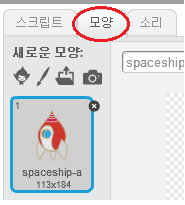
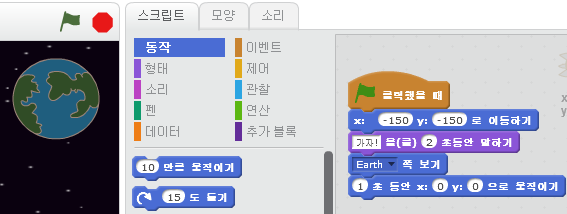
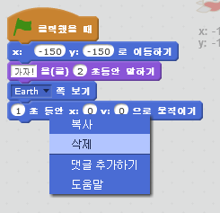
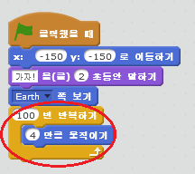
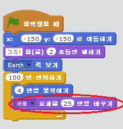
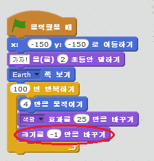
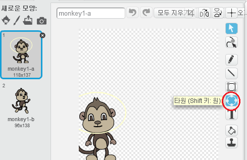
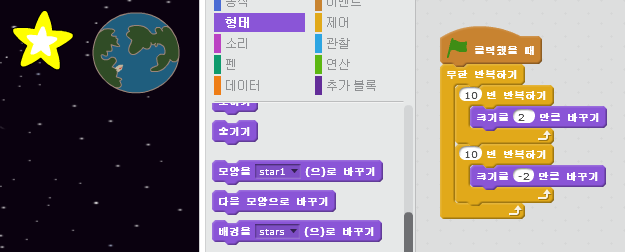

# 소개 { .intro }

나만의 애니메이션을 프로그램 하는 방법을 배울 것입니다!

<div class="scratch-preview">
  <iframe allowtransparency="true" width="485" height="402" src="http://scratch.mit.edu/projects/embed/26818098/?autostart=false" frameborder="0"></iframe>
  
</div>

# 1 단계: 우주선 움직이게 하기 { .activity .new-page}

지구로 날아가는 우주선을 만들어봅시다!

## 단계별 체크리스트 { .check }

+ 새 스크래치 프로젝트를 열고 고양이 스프라이트를 지워서 빈 프로젝트를 만드세요. 온라인 스크래치 에디터는 <a href="http://jumpto.cc/scratch-new">jumpto.cc/scratch-new</a> 에서 사용할 수 있습니다

+ 스테이지에 'Spaceship'과 'Earth' 스프라이트를 더해 넣고 스테이지엔  'Stars' 배경을 더해 넣으세요. 스테이지는 이렇게 꾸며질 것입니다:

	

+ 우주선 스프라이트를 클릭하고 '모양'탭을 누르세요.

	

+ 화살표 모양 도구로 이미지를 선택하고 위쪽 원형 회전 핸들을 눌러서 우주선이 누워있을 때까지 돌려주세요.

	

+ 우주선 스프라이트에 이 코드를 더해주세요:

	

	위 이미지와 같게 코드블록의 숫자들을 바꿔주세요.

+ 코드 블록을 눌러서 코드를 돌려보면 우주선이 '가자!' 라고 말한 후 돌아서 스테이지 중간으로 움직이는 걸 볼 수 있습니다.

	

	스크린 위치 `x:(0) y:(0)` {.blockmotion} 이 스테이지의 중심입니다. `x:(-150) y:(-150)` {.blockmotion} 은 왼쪽 상단 쪽이고 `x:(150) y:(150)` {.blockmotion} 은 오른쪽 상단 쪽입니다

	

	스테이지의 특정 위치의 좌표를 알아보려면 마우스를 원하는 위치에 올려놓으세요. 스테이지 아래에 좌표가 표기됩니다.

	

+ 스테이지 위의 녹색 깃발을 클릭해서 애니메이션을 시험해보세요.

	

## 도전과제: 애니메이션 개선하기 {.challenge}
애니메이션 코드의 숫자들을 바꿔서 다음이 가능하게 할 수 있나요?:
+ 우주선이 지구에 닿을 때까지 움직이게 하기.
+ 우주선이 더 느리게 지구에 다가가게 하기.

다음 블록의 숫자들을 바꿔야 할 것입니다:

```blocks
	glide (1) secs to x:(0) y:(0)
```

## 프로젝트를 저장하세요 { .save }

# 2 단계: 루프를 사용한 애니메이션 { .activity .new-page }

우주선을 움직이게 만드는 또다른 방법은 조금씩 움직이라고 명령한 것을 여러 번 실행시키는 것입니다.

## 단계별 체크리스트 { .check }

+ 코드에서 `...초 동안 x:... y:...으로 움직이기` {.blockmotion} 블록을 오른쪽 클릭 한 후 '삭제'를 눌러서 지우세요. 또한 블록을 스크립트 공간에서 코드블록 공간으로 드래그 해 가서 지울 수도 있습니다.

	

+ 코드를 지운 후에 이 코드를 대신 넣으세요:

	

	`반복하기` {.blockcontrol} 블록은 무언가를 여러 번 반복할 때 사용되며 또한 __루프__라고도 불립니다.

+ 깃발을 클릭해서 새 코드를 시험해보면 이전과 다를 것 없이 움직인다는 것을 볼 수 있습니다.

+ 루프에는 더 많은 코드를 더해서 더 여러가지 기능들을 실행 하게 만들 수 있습니다. 루프에 `색깔 효과는 25만큼 바꾸기` {.blocklooks} 블록('형태' 란에서)를 넣어서 우주선이 움직일 때 계속 색을 바꾸게 만들어 보세요:

	

+ 깃발을 클릭해서 새 애니메이션을 확인해봅시다.

	

+ 또한 우주선이 지구에 다가갈 수록 더 작아 보이게 만들 수도 있습니다.

	

+ 애니메이션을 시험할 때 깃발을 간격을 두고 두 번 클릭 해보세요. 우주선이 올바른 크기로 시작하나요? 이 블록을 사용해서 애니메이션을 고쳐 볼 수 있겠 나요?:

```scratch
크기를 (100)%로 정하기
```

## 프로젝트를 저장하세요 { .save }

# 3 단계: 떠다니는 원숭이들 { .activity .new-page }

우주에서 길을 잃은 원숭이들을 애니메이션에 더해봅시다!

## 단계별 체크리스트 { .check }

+ 원숭이 스프라이트를 저장소에서 더해주세요.

	

+ 원숭이 스프라이트를 클릭하고 '모양' 탭으로 가면 원숭이의 모습을 수정할 수 있습니다. '타원' 도구를 눌러서 원숭이의 머리 주위에 흰색 우주 헬멧을 그려주세요.

	

+ 이제 '스크립트' 탭에 돌아가서 원숭이에게 이 코드를 더해서 계속해서 천천히 돌아가게 만들어 주세요:

```blocks

깃발 클릭했을 때
무한 반복하기
   오른쪽으로 (1) 도 돌기
end
```

	`무한 반복하기` {.blockcontrol} 블록은 다른 종류의 루프이며 '반복하기'와는 달리 영원히 계속되는 루프입니다.

+ 깃발을 클릭해서 원숭이가 어떻게 움직이는 지 확인해보세요. 깃발 옆의 멈추기 버튼을 눌러야 애니메이션이 종료될 것입니다.

	

# 4 단계: 튕기는 운석들 { .activity .new-page }

애니메이션에 떠다니는 운석들을 더해봅시다.

## 단계별 체크리스트 { .check }

+ 'rock' 스프라이트를 스테이지에 더해주세요.

	

+ 돌덩어리에 이 코드를 넣어서 스테이지 안에서 튕겨 나가게 만드세요:

```scratch

깃발 클릭했을 때
[Earth v] 쪽 보기
무한 반복하기
   (2) 만큼 움직이기
   벽에 닿으면 튕기기
   ```
end

+ 깃발을 클릭해서 돌덩이가 어떻게 움직이는 지 확인 해보세요. 스테이지 안에서 튕겨 나가고 있나요?

# 5단계: 빛나는 별들 { .activity .new-page }

루프를 합쳐서 반짝이는 별을 만들어 봅시다.

## 단계별 체크리스트 { .check }

+ 스테이지에 'star' 스프라이트를 더해줍시다

	

+ 별 스프라이트에 이 코드를 넣어주세요:

	

+ 깃발을 눌러서 별 애니메이션을 확인해보세요. 이 코드가 어떤 역할을 하나요? 별을 조금더 크게 10번 다시 원래 크기로 10번 만듭니다. 이 두 루프가 `무한 반복하기` {.blockcontrol} 루프 안에 있기 때문에 애니메이션은 영원히 반복됩니다.

## 프로젝트를 저장하세요 { .save }

## 도전과제: 나만의 애니메이션을 만들어 보세요 {.challenge}
우주 애니메이션을 멈추고 '파일'에서 '새로 만들기'를 눌러서 새 프로젝트를 시작하세요.

이 프로젝트에서 배운 걸 응용해서 새로운 애니메이션을 만들어 보세요. 무엇이든 좋아하시는 걸 만들면 되지만 애니메이션이 배경에 맞도록 해보세요. 몇가지 예시 들입니다:


## 프로젝트를 저장하세요 { .save }
