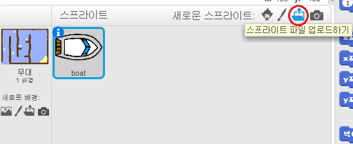
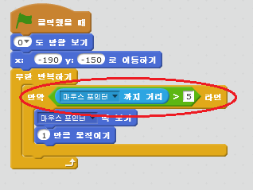
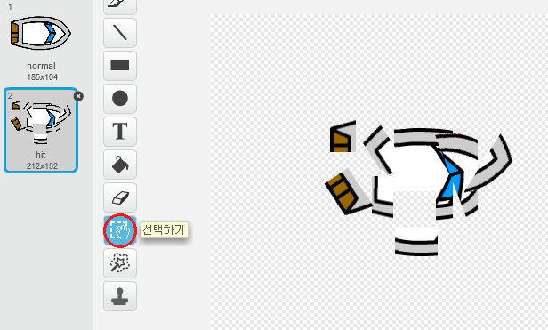
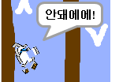
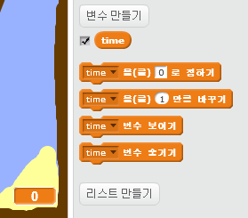
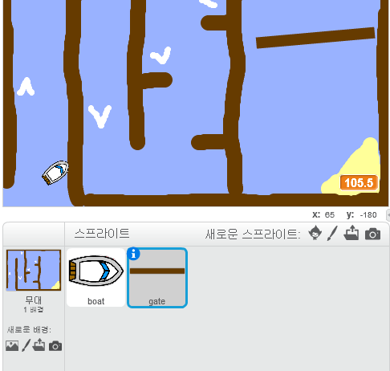
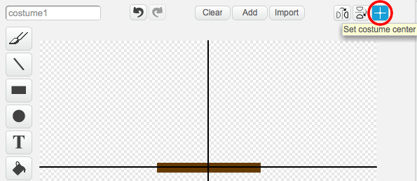
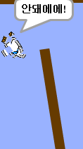

# 소개 { .intro }

마우스로 보트를 사막 섬으로 조종해가는 게임을 만들 것입니다.

<div class="scratch-preview">
  <iframe allowtransparency="true" width="485" height="402" src="http://scratch.mit.edu/projects/embed/63957956/?autostart=false" frameborder="0"></iframe>
  
</div>

# 1 단계: 게임 계획하기 { .activity }

## 단계별 체크리스트 { .check }

+ 새 스크래치 프로젝트를 시작하고 고양이 스프라이트를 지워 빈 프로젝트를 만드세요. 스크래치 에디터는 <a href="http://jumpto.cc/scratch-new">jumpto.cc/scratch-new</a> 이곳에서 찾을 수 있습니다.

+ 스테이지 배경을 클릭하고 난이도를 계획하세요. 이런 것들을 더해야 합니다:
	+ 보트가 피해야 할 나무;
	+ 보트가 도착해야 할 사막 섬.

	게임은 이런 모습일 것입니다:

	

# 2 단계: 보트 조종하기 { .activity }

## 단계별 체크리스트 { .check }

+ 클럽 리더에게 'Resources' 폴더를 받았다면 '스프라이트 파일 업로드하기' 를 눌러서 'boat.png' 를 업로드하세요. 스프라이트를 축소해서 올바른 시작 포지션에 두세요.

	

	boat.png가 없다면 자신의 보트를 직접 그릴 수도 있습니다!

+ 보트는 마우스로 조종할 것입니다. 이 코드를 보트에 더해주세요:

```blocks

깃발 클릭했을 때
(0 v) 도 방향 보기
x:(-190) y:(-150) 로 이동하기
무한 반복하기
   [마우스의 포인터 v] 쪽 보기
   (1) 만큼 움직이기
end
```

+ 깃발을 클릭하고 마우스를 움직이는 것으로 보트를 시험해보세요. 보트가 마우스가 가는 방향으로 가나요?

	

+ 보트가 마우스 포인터에 다다르면 어떻게 되나요?

	이 문제를 해결하려면 `만약` {.blockcontrol} 블록을 코드에 더해서 보트가 마우스에서 5픽슬 이상 떨어져 있을 때만 움직이도록 해야 합니다.

	

+ 보트를 다시 시험해서 문제가 해결됐는지 확인 해 보세요.

## 프로젝트를 저장하세요 { .save }

# 3 단계: 충돌! { .activity .new-page }

지금의 보트는 나무를 뚫고 나갑니다! 그걸 고쳐보죠.

## 단계별 체크리스트 { .check }

+ 보트에 두개의 모양이 필요합니다. 보통 모양 하나와 충돌했을 때의 모양 하나입니다. 보트 모양을 복사하고 하나는 'normal', 하나는 'hit'라고 이름 지으세요.

+ 'hit' 모양을 클릭하고 '선택하기' 도구를 골라서 보트의 부품들 몇개를 뒤집어 주세요. 보트가 파손된 것처럼 보이게 만드세요.

	

+ 이 코드를 보트의  `무한 반복하기` {.blockcontrol} 루프 안에 더해 나무 파편에 부딪히면 충돌하게 만드세요:

```blocks
만약 <[#603C15] 색에 닿기?> 라면
   모양을 [hit v] (으)로 바꾸기
   [안돼에에!] 을(를) (1) 초동안 말하기
   모양을 [normal v] (으)로 바꾸기
   (0 v) 도 방향 보기
   x:(-215) y:(-160) 로 이동하기
end
```

	이 코드는 `무한 반복하기` {.blockcontrol} 루프 안에 있기 때문에 코드가 계속해서 보트가 충돌했는지 확인하게 해줍니다.

+ 또한 언제나 보트가 '보통' 모습으로 시작하도록 해야 합니다.

+ 이제 나무 장애물을 뚫고 가려 하면 보트가 충돌 하고 시작 지점으로 돌아가는 걸 볼 수 있습니다.

	

## 프로젝트를 저장하세요 { .save }

## 도전과제: 승리! {.challenge}
또 하나의 `만약` {.blockcontrol} 조건을 보트에 더해서 플레이어가 사막 섬에 도착하면 승리하도록 만들 수 있나요?

보트가 사막 섬에 도착하면 '좋았어!’라고 출력되고 게임이 멈춰야 합니다. 이 코드를 넣으세요:

```blocks
[좋았어!] 을(를) (1) 초동안 말하기
[모두 v] 멈추기

```


## 프로젝트를 저장하세요 { .save }

## 도전과제: 음향효과 {.challenge}
보트가 충돌했을 때나 섬에 도착했을 때의 음향효과를 넣을 수 있나요? 또한 배경음악도 넣을 수 있습니다 (도움이 필요하면 이전에 했던 '록 밴드' 프로젝트를 돌아보세요)

## 프로젝트를 저장하세요 { .save }

# 4 단계: 시간 제한 { .activity }

타이머를 게임에 넣어서 플레이어가 섬에 최대한 빨리 도착해야 하도록 만들어 봅시다.

## 단계별 체크리스트 { .check }

+ 스테이지에 `time` {.blockdata}이라는 신규 변수를 만들어 넣으세요. 또한 변수의 디스플레이도 바꿔 볼 수 있습니다. 도움이 필요하다면 '풍선' 프로젝트를 돌아보세요.

	

+ 이 코드를 __스테이지__에 더해서 타이머가 사막 섬에 도착할 때 까지만 올라가도록 만드세요:

```blocks

깃발 클릭했을 때
[time v] 에 [0] 저장하기
무한 반복하기
   (0.1) 초 기다리기
   [time v] 을(를) (0.1) 만큼 바꾸기
end
```

+ 이걸로 끝입니다! 게임을 시작해서 얼마나 빨리 사막 섬에 도착할 수 있는지 보세요!

	

## 프로젝트를 저장하세요 { .save }

# 5 단계: 장애물과 파워 업 { .activity }

지금 이 게임은 _너무_ 쉽습니다 - 몇가지 요소를 더해 더 흥미롭게 만들어 봅시다.

## 단계별 체크리스트 { .check }

+ 첫번째로 게임에 보트의 속도를 올려주는 '부스터' 를 더해봅시다. 스테이지 배경을 편집해서 흰색 부스터 화살표들을 만들어 넣읍시다.

	

+ 이제 보트의 `무한 반복하기` {.blockcontrol} 루프에 코드를 더해 흰색 부스터를 건드리면 2 만큼 _더_ 움직이게 만듭시다:

```blocks
만약 <[#FFFFFF] 색에 닿기?> 라면
   (3) 만큼 움직이기
end
```

+ 또한 보트가 피해야 할 회전 게이트를 만들어 넣읍시다. 이렇게 생긴 'gate'라는 스프라이트를 넣으세요:

	

	게이트의 색은 나무 배리어와 같게 만듭시다.

+ 게이트 스프라이트의 중심점을 정합시다.

	

+ 게이트에 코드를 더해 천천히 도는 걸  `무한 반복하기` {.blockcontrol} 하게 하세요.

+ 게임을 다시 시험해보세요. 이제 보트가 피해야 할 회전 게이트가 더해졌을 겁니다.

	

## 프로젝트를 저장하세요 { .save }

## 도전과제: 더 많은 장애물! {.challenge .new-page}
게임에 더 많은 장애물을 넣을 수 있나요? 몇가지 아이디어들 입니다:

+ 배경에 초록색 점액을 더해 플레이어가 건드리면 느리게 만들어 버릴 수 있습니다 `기다리기` {.blockcontrol} 블록을 사용해 적용할 수 있습니다:

```blocks
(0.01) 초 기다리기
````


+ 통나무나 상어같은 움직이는 오브젝트를 넣을 수도 있습니다!


이 블록들이 도움이 될 것입니다:

```blocks
(1) 만큼 움직이기
벽에 닿으면 튕기기
````

새 오브젝트가 갈색이 아니라면 보트에 다음 코드를 넣어야 됩니다:

```blocks
만약 <<[#603C15] 색에 닿기?> 또는 <[shark v] 에 닿기?>> 라면
end
```

## 프로젝트를 저장하세요 { .save }

## 도전과제: 더 많은 보트! {.challenge .new-page}
게임을 2명의 플레이어가 경쟁하는 레이스로 만들 수 있나요?

+ 보트를 복사한 후 이름을 'Player 2'로 바꾸고 색깔도 바꾸세요.


+ 두번째 보트의 시작점을 이 코드로 바꾸세요:

```blocks
x:(-190) y:(-150) 로 이동하기
```

+ 마우스로 보트를 조종하는 코드를 지우세요:

```blocks
만약 <([마우스의 포인터 v] 까지 거리) > [5]> 라면
   [마우스의 포인터 v] 쪽 보기
   (1) 만큼 움직이기
end
```

...그리고 방향키로 보트를 조종하는 코드로 바꿔 넣으세요.

앞으로 움직이게 하는데 필요한 코드는 이것입니다:

```blocks
만약 <[위쪽 화살표 v] 키를 눌렀는가?> 라면
   (1) 만큼 움직이기
end
```

또한 보트를 `방향을 돌리는데` {.blockmotion} 필요한 코드도 필요할 것입니다.

## 프로젝트를 저장하세요 { .save }

## 도전과제: 더 많은 난이도! {.challenge .new-page}
더 많은 배경을 만들어서 플레이어가 난이도 레벨 사이를 고를 수 있게 만들 수 있나요?

```blocks

[스페이스 v] 키 눌릴 때
다음 배경으로 바꾸기
```

## 프로젝트를 저장하세요 { .save }
