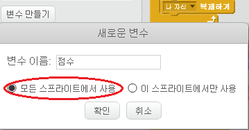
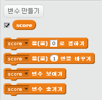
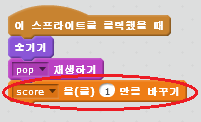
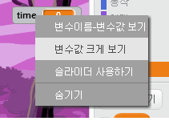

# 소개 { .intro }

유령을 잡는 게임을 만들어 볼 것입니다!

<div class="scratch-preview">
  <iframe allowtransparency="true" width="485" height="402" src="http://scratch.mit.edu/projects/embed/60787262/?autostart=false" frameborder="0"></iframe>
  
</div>

# 1 단계: 유령 움직이게 하기 { .activity }

## 단계별 체크리스트 { .check }

+ 새 스크래치 프로젝트를 시작하고 고양이 스프라이트를 지워서 텅 빈 프로젝트를 만드세요. 스크래치 온라인 에디터는 <a href="http://jumpto.cc/scratch-new">jumpto.cc/scratch-new</a> 에서 찾을 수 있습니다.

+ 유령 스프라이트와 어울리는 배경을 넣으세요.

	

+ 유령에게 이 코드를 넣어서 나타났다 사라지게 만드세요:

```blocks

깃발 클릭했을 때
무한 반복하기
   숨기기
   (1) 초 기다리기
   보이기
   (1) 초 기다리기
end
```

+ 녹색 깃발을 눌러서 유령의 코드가 작동하는지 확인해보세요.

## 프로젝트를 저장하세요 { .save }

# 2 단계: 무작위 유령들 { .activity }

지금의 유령은 움직이지 않기 때문에 잡기 너무 쉽습니다!

## 단계별 체크리스트 { .check }

+ 유령이 가만히 있지 않고 스크래치가 무작위 x와 y 좌표를 지정하게 만들 수 있습니다. 유령의 코드에 `x:... y:...로 이동하기` {.blockmotion} 블록을 더해 이렇게 보이게 만드세요:

```blocks

깃발 클릭했을 때
무한 반복하기
   숨기기
   (1) 초 기다리기
   x:((-150) 부터 (150) 사이의 난수) y:((-150) 부터 (150) 사이의 난수) 로 이동하기
   보이기
   (1) 초 기다리기
end
```

+ 유령을 다시 시험해보세요. 이제 매번 다른 곳에서 나타날 것입니다.

## 프로젝트를 저장하세요 { .save }

## 도전과제: 더욱 더 무작위로 {.challenge}
유령이 다시 나타나기 전 무작위로 `...초 기다리기` {.blockcontrol} 하게 할 수 있나요? `크기를 ...%로 정하기` {.blocklooks} 블록을 써서 유령이 나타날 때마다 무작위 크기로 나오게 만들 수 있나요?

## 프로젝트를 저장하세요 { .save }

# 3 단계: 유령 잡기 { .activity }

플레이어가 유령을 잡을 수 있도록 만듭시다!

## 단계별 체크리스트 { .check }

+ 플레이어가 유령을 잡을 수 있게 하려면 이 코드를 더해주세요:

```blocks

이 스프라이트를 클릭했을 때
숨기기
```

+ 프로젝트를 다시 시험해보세요. 유령이 나타났을 때 클릭해서 잡을 수 있나요? 유령을 잡기 힘들다면 이 버튼을 클릭해서 전체화면 모드로 플레이 할 수 있습니다:

	

## 도전과제: 음향효과 더하기 { .challenge }
유령이 잡힐때 마다 소리가 나게 할 수 있나요?

## 프로젝트를 저장하세요 { .save }

# 4 단계: 점수 더하기 { .activity .new-page }

점수를 더해 게임을 좀 더 흥미롭게 만들어 봅시다.

## 단계별 체크리스트 { .check }

+ 플레이어의 점수를 세기 위한 장소가 필요합니다. __변수__는 점수와 같이 달라지는 데이터를 저장할 수 있는 장소 입니다.

	새 변수를 만들려면 '스크립트' 탭을 누른 후 `데이터` {.blockdata} 란으로 간 후 '변수 만들기'를 클릭하세요.

	

	변수의 이름을 'score' 로 짓고 모든 스프라이트에서 사용 가능하게 만든 후 '확인'을 눌러서 변수를 만드세요. 그러면 `score` {.blockdata} 변수와 함께 쓸 수 있는 코드 블록들이 보일 것입니다.

	

	또한 점수를 스테이지의 왼쪽 상단에서 확인 할 수도 있을 것입니다.

	

+ 녹색 깃발을 클릭해서 새 게임이 시작되면 플레이어의 점수를 0으로 맞춰줘야 합니다:

```blocks

깃발 클릭했을 때
[score v] 에 [0] 저장하기
```

+ 유령이 잡힐 때 마다 점수가 1씩 올라가도록 해야 합니다:

	

+ 게임을 다시 시작해서 유령을 잡아보세요. 점수가 올라가나요?

## 프로젝트를 저장하세요 { .save }

# 5 단계: 타이머 더하기 { .activity }

또한 10초 안에 최대한 많은 유령을 잡게 해서 게임을 더 흥미롭게 만들 수 있습니다.

## 단계별 체크리스트 { .check }

+ 남은 시간을 표기하기 위해 다른 변수를 사용합시다. 스테이지를 클릭 한 후 새로운 변수 'time'을 만드세요:

	

+ 타이머는 이렇게 작동해야 합니다:

	+ 타이머는 10초에서 시작합니다;
	+ 타이머는 1초씩 내려갑니다;
	+ 타이머가 0초가 되면 게임이 끝나야 합니다.

	__스테이지__에 더할 코드는 이렇습니다:

```blocks

깃발 클릭했을 때
[time v] 에 [10] 저장하기
<(time) = [0]> 까지 반복하기
   (1) 초 기다리기
   [time v] 을(를) (-1) 만큼 바꾸기
end
[모두 v] 멈추기

```

	`...까지 반복하기`{.blockcontrol}`time`{.blockdata}`= 0`{.blockoperators} 코드를 사용하는 방법입니다:

	

+ 'time'변수 디스플레이를 스테이지 오른쪽으로 옮기세요. 또한 변수 디스플레이에 오른쪽 클릭 한 후 '변수값 크게 보기'를 선택해서 더 크게 보이게 만들 수 있습니다.

	

+ 친구에게 게임을 해보게 하세요. 몇 점을 받을 수 있나요? 게임이 너무 쉬워 보인다면 다음으로 난이도를 올릴 수 있습니다:

	+ 플레이어에게 시간을 더 적게 주기;
	+ 유령들이 더 뜸하게 나오게 하기;
	+ 유령을 더 작게 만들기.

	게임이 알맞는 난이도라고 생각될 때까지 몇 번 더 시험해보세요.

## 프로젝트를 저장하세요 { .save }

## 도전과제: 더 많은 오브젝트 {.challenge}
게임에 다른 오브젝트들을 더할 수 있나요?


더할 오브젝트에 대해 몇가지를 생각해보세요:

+ 얼마나 큰 가요?
+ 유령보다 더 자주 혹은 뜸하게 나올 건가요?
+ 잡혔을 땐 어떻게 보이고 들릴 건가요?
+ 잡았을 땐 몇 점을 얻거나 잃게 되나요?

다른 오브젝트를 더하는데 도움이 필요하다면 위의 단계들을 다시 자세히 살펴보세요!

## 프로젝트를 저장하세요 { .save }
