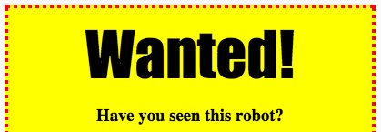

# 소개 { .intro}

이 프로젝트에선 포스터를 만드는 방법을 배울 것입니다.


# 1 단계: 포스터 꾸미기 { .activity}

먼저 포스터의 CSS 코드를 수정합시다.

## 단계별 체크리스트 { .check}

+ 다음 트링켓을 여세요: <a href="http://jumpto.cc/web-wanted" target="_blank">jumpto.cc/web-wanted</a>. 혹은 온라인으로 읽고 있다면 아래의 embed 된 트링켓을 사용하세요.

<div class="trinket">
	<iframe src="https://trinket.io/embed/html/58318bee1f" width="100%" height="550" frameborder="0" marginwidth="0" marginheight="0" allowfullscreen>
	</iframe>
</div>

+ "style.css" 탭을 클릭해보세요. 이미 포스터의 부분들을 포함하고 있는 'div'에 CSS 속성이 있다는 걸 보실 겁니다.

	```
	div {
		text-align: center;
	    overflow: hidden;
	    border: 2px solid black;
	    width: 300px;
    }
	```

+ 먼저 `text-align` 속성을 수정해봅시다:

	```
	text-align: center;
	```

	`center` 를 `left` 나 `right`로 수정하면 어떻게 되나요?

+ `border` 속성은 어떤 가요?

	```
	border: 2px solid black;
	```

	위 코드의 `2px` 이란 2 픽셀이란 뜻입니다. `2px solid black` 을 `4px dotted red` 바꾸면 어떻게 되나요?

+ 포스터의 `width`를 `400px`로 바꿔보세요. 포스터가 어떻게 되나요?

+ 포스터의 배경색에 CSS를 더해봅시다. 코드의 5번째 줄로 가서 엔터를 쳐서 빈 줄이 생기게 만드세요.

	

	새 빈 줄에 다음 코드를 넣으세요:

	```
	background: yellow;
	```

	코드를 위와 정확히 같게 넣도록 하세요. 이제 `<div>` 의 배경색이 노란색 인걸 볼 수 있을 것입니다.

	

##도전과제: 포스터 개선하기{.challenge}
다음 CSS 속성을 `div` 스타일에 더하세요:

```
border-radius: 40px;
```

이 속성은 어떤 기능을 가지고 있나요? 위 코드의 숫자를 바꾸면 어떻게 되나요?

## 프로젝트를 저장하세요 {.save}

# 2 단계: 이미지 스타일 하기{ .activity}

포스터에 사용되는 이미지의 스타일을 개선해봅시다.

## 단계별 체크리스트 { .check}

+ 지금으로선 `` 태그에 사용되는 CSS 속성이 없으니 더해봅시다!

	먼저 다음 코드를 div의 CSS 아래에 넣으세요:

	```
	img {

	}
	```

	

+ 이제 이미지에 쓸 CSS 속성을  `{` and `}` 와 중괄호 사이에 더할 수 있습니다.

	예를 들어서 이 코드를 중괄호 사이에 더해서 이미지의 넓이를 지정하세요:

	```
	width: 100px;
	```

	이미지의 넓이가 100 픽슬로 바뀌는 걸 볼 수 있습니다..

	

+ 또한 이 코드로 이미지 밖에 테두리를 더할 수 있습니다:

	```
	border: 1px solid black;
	```

+ 이미지와 테두리 사이에 공간이 별로 없는 걸 보셨 나요?

	

	이미지 주변에 패딩을 더해서 해결할 수 있습니다:

	```
	padding: 10px;
	```

	패딩이란 콘텐츠(이번 경우엔 이미지)와 테두리 사이의 공간을 뜻합니다.

	

	패딩을  `50px`로 바꾸면 어떻게 될 거라고 생각하시나요?

##도전과제: 이미지 개선하기 {.challenge}
이미지에 배경색을 주거나 둥근 테두리를 더할 수 있겠 나요?

## 프로젝트를 저장하세요 {.save}

# 3 단계: 헤딩 스타일하기{ .activity .new-page }

`<h1>` 헤딩의 스타일을 개선해봅시다.

## 단계별 체크리스트 { .check}

+ 다음 코드를 이미지의 CSS 아래에 더하세요:

	```
	h1 {

	}
	```

	여기에`<h1>` 헤딩의 CSS 속성을 더할 것입니다.

+ `<h1>` 헤딩의 폰트를 바꾸려면 중괄호 사이에 다음 코드를 넣으세요:

	```
	font-family: Impact;
	```

+ 또한 헤딩의 크기를 바꿀 수도 있습니다:

	```
	font-size: 50pt;
	```

+ 	`<h1>` 헤딩과 주변에 있는 것들 사이에 넓은 공간이 남는다는 걸 보셨 나요?

	

	이건 헤딩 주변에 마진이 있기 때문입니다. 마진이란 요소(이 경우엔 헤딩)과 주변의 다른 것들 사이의 공간을 뜻합니다.

	이 코드로 마진을 더 작게 만들 수 있습니다:

	```
	margin: 10px;
	```

	

+ 또한 헤딩에 밑줄을 그을 수 있습니다:

	```
	text-decoration: underline;
	```

##도전과제: 포스터를 멋지게 만들어보세요! {.challenge}
`<h3>` 헤딩과 문단들에 CSS코드를 더해 스타일 해보세요.


다음은 사용할 만한 CSS 코드들입니다:

```
color: black;
background: white;
font-family: Arial / Comic Sans MS / Courier / Impact / Tahoma;
font-size: 12pt;
font-weight: bold;
text-decoration: underline overline line-through;
margin: 10px;
padding: 10px;
width: 100px;
height: 100px;
```

## 프로젝트를 저장하세요 {.save}

##도전과제: 이벤트를 홍보해보세요!{.challenge}
학교 행사의 포스터를 만들어 볼 수 있나요? 연극, 스포츠 경기, 혹은 코드클럽을 홍보하는 포스터일수도 있습니다!

## 프로젝트를 저장하세요 {.save}
